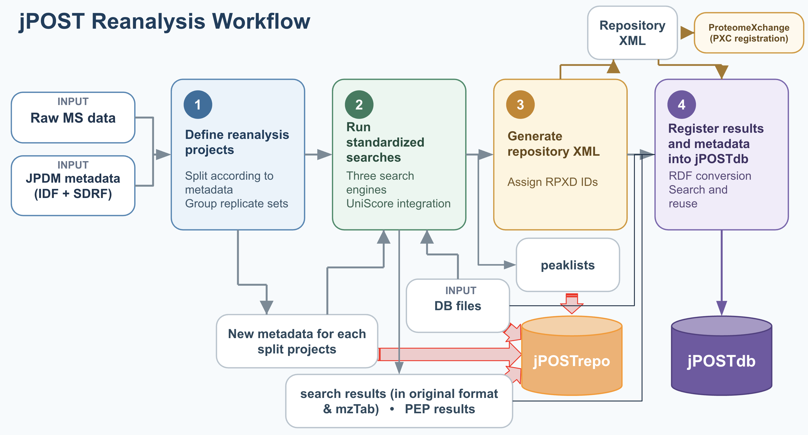
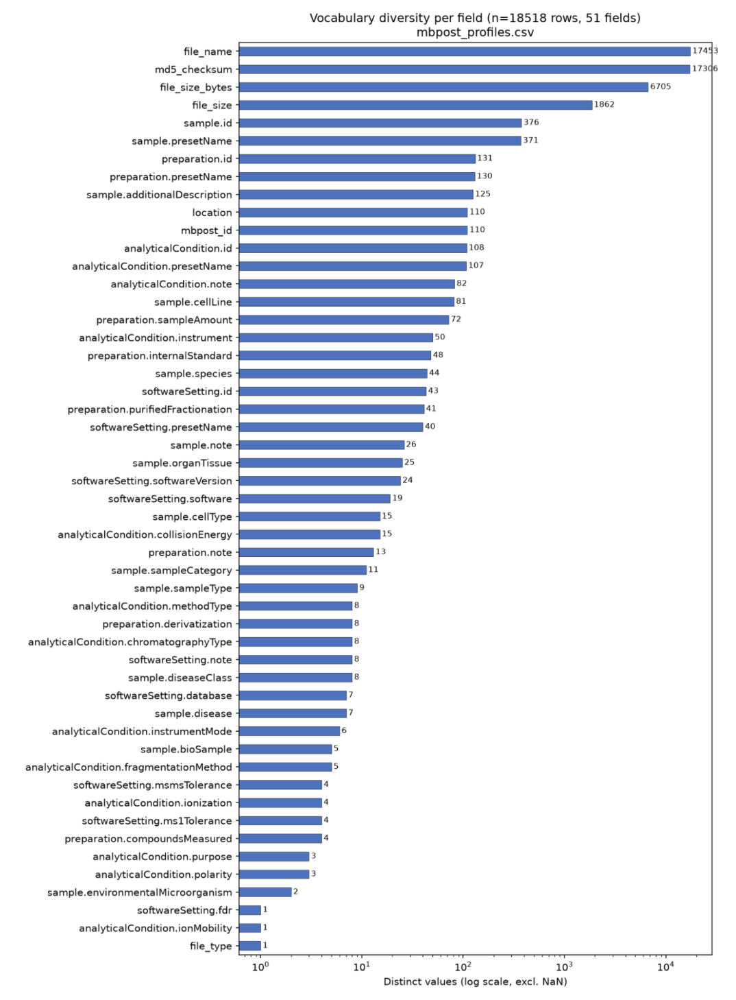

---
title: 'DBCLS BioHackathon 2026 report: Mass spectrometry data analysis workflow and visualization towards trans-omics research'
title_short: 'BioHackJP26: MS data analysis workflow and visualization'
tags:
  - Mass spectrometry
  - Proetome
  - Metabolome
authors:
  - name: Akiyasu C. Yoshizawa
    orcid: 0000-0002-0870-5502
    affiliation: 1
    role: Conceptualization, Writing – original draft
  - name: Yuki Moriya
    orcid: 0000-0001-8195-5893
    affiliation: 2
    role: Software, Visualization, Writing – original draft
  - name: Kozo Nishida
    orcid: 0000-0001-8501-7319
    affiliation: 3
    role: Software, Investigation, Writing – original draft
  - name: Yushi Takahashi
    orcid: 0000-0002-9194-6293
    affiliation: 1
    role: Software, Investigation, Methodology
  - name: Satoshi Tanaka
    orcid: 0000-0001-5266-0914
    affiliation: 4
    role: Software, Investigation
  - name: Shin Kawano
    orcid: 0000-0002-7969-2972
    affiliation: 5 
    role: Software, Conceptualization, Supervision
  - name: Susumu Goto
    orcid: 0000-0002-7969-2972
    affiliation: 2
    role: Conceptualization, Supervision, Project administration, Writing – original draft
affiliations:
  - name: Medical AI Center, Niigata University School of Medicine, Niigata, Japan
    index: 1
  - name: Database Division for Life Science (DBCLS), BioData Science Initiative (BSI), National Institute of Genetics, Research Organization of Information and Systems, Chiba, Japan
    ror: 
    index: 2
  - name: RIKEN Center for Biosystems Dynamics Research, Kobe, Japan
    ror: 
    index: 3
  - name: Trans-IT Co., Ltd., Mibu-machi, Tochigi, Japan
    index: 4
  - name: School of Frontier Engineering, Kitasato University, Sagamihara, Kanagawa, Japan
    ror: 
    index: 5
date: 18 September 2026
cito-bibliography: paper.bib
event: BH26JP
biohackathon_name: "DBCLS BioHackathon 2026"
biohackathon_url:   "https://2026.biohackathon.org/"
biohackathon_location: "Matsuyama, Japan, 2026"
group: MS-data
# URL to project git repo --- should contain the actual paper.md:
git_url: https://github.com/biohackathon-japan/BH26-MS-data
# This is the short authors description that is used at the
# bottom of the generated paper (typically the first two authors):
authors_short: Akiyasu C. Yoshizawa, Yuki Moriya \emph{et al.}
---

# Abstract

Public mass spectrometry (MS) repositories contain rapidly growing collections of proteomic, metaproteomic, and metabolomic data, but differences in analytical procedures, metadata, data formats, and visualization environments limit their reuse and integration. During BioHackathon 2026, we developed complementary components of an infrastructure for standardized reanalysis and trans-omics applications. First, we redesigned the jPOST proteomics reanalysis workflow to improve scalability, reduce manual intervention, and facilitate consistent transfer of data and metadata among the repository, reanalysis system, and jPOSTdb. The workflow uses detailed JPDM metadata and integrates results from three search engines using UniScore. Second, we developed metaproteome visualizations that connect spectral evidence with metabolic pathways and microbial phyla, enabling functional comparison among samples and experimental groups. Third, we enhanced Mass++4, a cross-platform spectrum and chromatogram viewer, by improving its connectivity with public repositories and expanding functions relevant to the inspection of proteomic and metabolomic data. Finally, we investigated the interoperability of MB-POST with the MetabolomicsHub common data model and mzTab-M. This analysis identified requirements for controlled-vocabulary mapping, explicit representation of experimental factors and sample groups, and standardization of quantitative-result formats. Together, these developments connect raw-data preservation, standardized metadata, reproducible reanalysis, biological visualization, and cross-repository interoperability. Although further implementation and large-scale validation are required, they provide a practical foundation for integrating proteomic, metaproteomic, and metabolomic data in future trans-omics studies.

# Introduction

Mass spectrometry (MS)-based metabolomics and proteomics have become indispensable approaches for characterizing the molecular states of biological systems. Advances in high-resolution MS, chromatographic separation, data-dependent acquisition, data-independent acquisition, and computational analysis now enable the detection and quantification of thousands of metabolites and proteins across diverse sample types. Metabolomics provides a sensitive readout of biochemical activity and physiological responses, whereas proteomics captures changes in protein abundance, modification, localization, and interaction that cannot be inferred directly from genomic or transcriptomic data. In parallel, metaproteomics—the large-scale analysis of proteins expressed by microbial communities—has emerged as a powerful means of linking community composition to functional activity in complex ecosystems, including the human microbiome and environmental samples. By identifying both microbial taxa and their expressed functions, metaproteomics complements metagenomic and metatranscriptomic analyses and provides more direct evidence of the biological processes occurring within a community.

Despite this progress, the reuse and integration of MS-based omics data remain challenging. Public repositories contain a rapidly growing collection of proteomics, metaproteomics, and metabolomics datasets, but differences in metadata completeness, experimental design, acquisition methods, identification criteria, quantitative procedures, and database versions often hinder systematic reanalysis and cross-study comparison. Metaproteomic data pose additional difficulties because peptide sequences may be shared among multiple taxa, reference databases are highly complex, and protein functions must be interpreted together with their microbial origins. Furthermore, analytical results are commonly represented in domain-specific formats and visualized separately for individual omics layers, making it difficult to investigate coordinated relationships among metabolites, proteins, microorganisms, pathways, and phenotypes. Standardized and reproducible reanalysis workflows, together with interactive visualization tools that organize results using common biological entities and pathways, are therefore required to unlock the value of publicly available MS data. Such an infrastructure would provide a foundation for trans-omics analysis, in which molecular measurements from different omics layers are integrated to reconstruct the flow of biological information and generate mechanistic hypotheses about cellular and microbial systems.

Reanalysis is particularly important for mass spectrometry-based omics, especially proteomics, for two principal reasons. The first is the limited detection scope of the original analysis. Proteomic experiments and their associated database searches are generally optimized for a specific scientific objective and therefore explore only a restricted portion of the information contained in the acquired spectra. For example, a search that considers only unmodified peptides will fail to detect spectra derived from modified forms, whereas including plausible post-translational or chemical modifications can increase peptide and protein coverage. Likewise, experiments using multiple isotopic or isobaric labels may require separate searches designed to quantify particular label combinations; although appropriate for the original study, such strategies may leave other identifiable peptides unexplored. Reanalysis with a broader or differently defined search space can therefore recover additional information from the same raw data. Moreover, search engines, spectral-processing algorithms, reference databases, and statistical models are continually improving. The predominant analysis platforms have consequently changed over time—from workflows centered on tools such as Mascot [@RN448] to those based on MaxQuant/Andromeda [@RN337] [@RN1448] and, more recently, MSFragger [@RN126] and the FragPipe ecosystem. Reprocessing legacy datasets using current algorithms and updated sequence databases can yield more sensitive and reliable identifications than were possible when the data were originally generated. For secondary databases in particular, systematic reanalysis independent of the original study-specific settings is therefore essential for maximizing protein coverage and producing consistently processed results across datasets.

The second reason concerns the control of false discoveries. Peptide-spectrum matching involves comparing large numbers of experimental spectra against many candidate peptide sequences, creating a multiple-testing problem in which some apparently significant matches inevitably occur by chance. Proteomics commonly addresses this problem using a target–decoy strategy [@RN60], in which spectra are searched against both biologically plausible target sequences and artificial decoy sequences, typically generated by reversing or shuffling target proteins. Matches to decoys provide an empirical estimate of incorrect target matches under a particular combination of spectra, search database, scoring procedure, and search parameters. Consequently, the estimated false discovery rate (FDR) [@RN383] is conditional on the dataset and analytical workflow from which it was calculated; it cannot necessarily be preserved when separately filtered result sets are combined, divided, or compared. Simply merging identifications that were each reported at an FDR of 1%, for example, does not guarantee that the combined collection will retain the same error rate, particularly when the datasets differ in composition, search space, or score distribution. When results from multiple studies are integrated, the underlying spectra should therefore be searched—or at least statistically evaluated—together, followed by renewed target–decoy-based FDR estimation at the relevant levels, such as peptide-spectrum match, peptide, and protein. This dependence of error control on the complete search context explains why preserving only published identification tables is insufficient. Long-term storage of raw MS data, detailed metadata, and analysis parameters is indispensable for reliable data integration, and reanalysis is a prerequisite for constructing large-scale proteomic and metaproteomic resources suitable for comparative and trans-omics studies.

To facilitate the systematic reuse of public proteomics data, the jPOST project has been developing jPOSTdb [@RN103], a secondary database that stores datasets reprocessed according to standardized analysis protocols. In this study, we report the work conducted during BioHackathon 2026 to establish reproducible workflows for proteomic data reanalysis and to develop tools for visualizing the resulting data, with a particular focus on metaproteomic datasets. We also describe developments aimed at extending this framework toward trans-omics analysis integrating proteomic and metabolomic information, including functional enhancements to Mass++ [@RN52], a high-performance mass-spectrometry data viewer, and efforts to improve data interoperability among metabolomics repositories. Together, these developments provide a foundation for the standardized reanalysis, visualization, and cross-omics integration of MS-based datasets.

# Establishment of the reanalysis workflow

## Proteomics data reanalysis in jPOST

As described above, reanalysis is essential for maximizing the value of proteomics data. In the jPOST project, selected datasets submitted to the jPOST repository are reprocessed using a standardized strategy designed not only to reproduce the original analysis but also to provide additional value through improved identification reliability, comprehensive metadata utilization, and integration into jPOSTdb [@RN106]. To improve the reliability and sensitivity of peptide and protein identification, we developed UniScore, a unified scoring scheme intended to reduce false-positive identifications [@RN236]. Each dataset is searched using three different search engines, and their outputs are integrated to minimize engine-specific false negatives. Identifications from the individual engines are ranked and consolidated on the basis of UniScore, thereby enabling the complementary results of multiple search algorithms to be incorporated within a common statistical framework.

The reanalysis conditions are determined using metadata represented in the JPDM format, which is provided by the Journal of Proteome Data and Methods (JPDM) and substantially compatible with the Sample and Data Relationship Format (SDRF) specified by the Human Proteome Organization Proteomics Standards Initiative (HUPO-PSI) [@RN57]. The JPDM format incorporates information corresponding to both SDRF and the Investigation Description Format (IDF), allowing experimental design, sample characteristics, and data-acquisition conditions to be handled together. In addition, JPDM records injection-replicate relationships, which are not explicitly represented in the standard SDRF specification. The use of injection-replicate information can strengthen the evidence for peptides that would otherwise be supported only weakly in an individual LC–MS/MS run. Collectively, these metadata enable search parameters and data groupings to be defined more accurately and reduce the risk that relevant experimental information will be overlooked during reanalysis.

The reanalysis results are incorporated into jPOSTdb so that they can be searched, compared, and reused by a broad range of users. Metadata generated or curated during reanalysis are retained as attributes of the corresponding data, making them directly available for database searches and downstream analyses. To improve search efficiency and ensure that datasets within jPOSTdb have internally consistent attributes, we established explicit rules for reorganizing deposited projects. An original repository project is first divided into one or more *reanalysis projects*, each consisting of raw-data files for which all dataset-defining metadata are identical, apart from replicate identifiers. Within each reanalysis project, files that differ only in a replicate identifier—excluding injection-replicate information—are assigned to separate *datasets*. Thus, if three replicate identifiers occur within a reanalysis project, the project is considered to contain three datasets, and these units are retained as the datasets presented in jPOSTdb. Importantly, a replicate identifier denotes the identity of a replicate set rather than the total number of replicates. For example, in an experiment involving biological samples from three patients, data derived from patients 1, 2, and 3 are assigned replicate identifiers 1, 2, and 3, respectively.

An initial version of the reanalysis workflow and its associated scripts was developed in 2024 and reported previously. However, substantially increasing both the number of reanalyzed projects and the volume of data incorporated into jPOSTdb required a more efficient workflow with fewer manual intervention points. We therefore conducted a comprehensive review of the workflow and its implementation. The original developer, one of the authors, first documented the purpose, assumptions, and intended behavior of each script. These descriptions and the complete set of scripts were then examined using Claude, a large language model, to identify inconsistencies, redundancies, and potentially inefficient procedures. The developer subsequently evaluated these observations, added technical explanations, and, where appropriate, challenged the model’s interpretations. This iterative human–LLM review helped reconstruct the overall logic of the existing system and identify components that required redesign.

The jPOST reanalysis system comprises three operational components: data deposition in the repository, computational reanalysis, and registration of the processed results in jPOSTdb. These components were designed to proceed with a degree of independence—particularly the repository and reanalysis operations—to avoid unnecessary delays. Such operational separation is also necessary because the three components are managed at geographically distributed sites in Niigata, Kyoto, and Kashiwanoha. However, this architecture created difficulties in transferring and reconciling identifiers and metadata among the components. In the previous workflow, metadata were generated in several stages: an initial metadata set was used to perform the reanalysis, after which additional metadata were derived from the analysis results. During the present redesign, explicit operational rules were introduced so that, wherever possible, the complete metadata set could be generated before reanalysis. This change simplified the exchange of identifiers and metadata among the three components and reduced dependencies between successive processing steps.

These improvements primarily concern operational standardization and scalability rather than the development of a new analytical method. Nevertheless, such workflow engineering is indispensable for the sustained expansion of a secondary proteomics database. Once routine operation of the redesigned workflow has been stabilized, we plan to use it to incorporate projects on a scale far exceeding 1,000 studies, thereby expanding the coverage and practical utility of jPOSTdb for large-scale comparative, metaproteomic, and trans-omics analyses.

# Metaproteome data visualization

We developed and integrated a new set of visualizations that place metaproteome identifications in the context of metabolic pathways and the taxa contributing to them. The visualizations take as input the results of MetaPilot, a metaproteome analysis software, in which peptide–spectrum matches (PSMs) are assigned to proteins from a sequence database derived from metagenome-assembled genomes (MAGs). The MAG protein FASTA dataset has been functionally annotated using eggNOG-mapper, and for each protein, fields from that output—such as the “EC number,” “COG classification,” and “eggNOG taxonomy” indicating the source organism’s phylum—are utilized.

**Pathway mapping.** Proteins are linked to UniProt Pathway annotations primarily through EC numbers, with COG assignments used as a fallback for proteins that cannot be mapped via EC numbers. Pathways are organized into a three-level hierarchy of functional groups, classes, and individual pathways. All values are weighted by PSM count, so each pathway reflects its share of the spectral evidence rather than the number of distinct proteins. The proportion of PSMs mapped to any pathway, and how much of it comes through EC numbers versus COGs, is reported alongside each view to make annotation coverage explicit.

**Per-sample and group comparison views.** The per-sample view displays the pathway class composition of each sample as a stacked bar, grouped by the sample metadata (Figure 2, top left). The group comparison view summarizes each group as the mean composition of its samples, so that functional profiles can be compared between groups at a glance (Figure 2, top right). Differences between groups are tested for each pathway class, with correction for multiple testing, and the result is summarized in the view.

**Sample-level interpretation by phylum.** To relate functional profiles to the organisms that produce the detected proteins, each sample page includes a tree heatmap (Figure 2, bottom). Rows follow the pathway hierarchy and columns correspond to phyla. A bar for each row shows its share of all mapped PSMs in the sample, while each cell shows the share of that phylum's own mapped PSMs. Because cells are normalized within each phylum, columns can be read as phylum-specific functional profiles independent of phylum abundance. Column headers show each phylum's share of PSMs and its pathway mapping rate. The hierarchy is collapsed to functional groups by default and can be expanded down to individual pathways, keeping even hundreds of pathways readable with their full names. The underlying values are also available through an API, allowing the same summaries to be used programmatically. Phylum assignments are taken from the eggNOG-mapper lineage, which reflects the NCBI Taxonomy snapshot of the eggNOG database version used (eggNOG 5.0) and therefore retains older phylum names (e.g., Firmicutes), whereas the original taxonomy of the MAGs provided by Microbiome Datahub uses the updated nomenclature (e.g., Bacillota).

![Figure 2. Metaproteome visualization. (Top left) Per-sample UniProt Pathway class composition, grouped by sample category. (Top right) Group comparison of mean pathway composition. (Bottom) Pathways by phylum for a single sample. Bars show the share of all mapped PSMs; cells show the share of each phylum's own mapped PSMs (darker is larger, scaled per level). Phylum assignments are taken from the eggNOG lineage of each protein. Pathway distributions are thus linked to the phyla contributing the detected proteins.](./media/image2.png)

# Enhancement of Mass++4 towards trans-omics research

Mass++4 is the latest version of the Mass++ software series [@RN52], which has been downloaded approximately 20,000 times since the first version was released in June 2009. Mass++ is a data viewer designed for the interactive inspection of mass spectra and chromatograms. In contrast to the earlier versions, which were developed exclusively for Windows, Mass++4 was rewritten in Java to support multiple operating systems and provide a more sustainable basis for future development.

Up to version 2, Mass++ was developed primarily by a commercial company and was distributed free of charge as closed-source software. The source code was first released with version 2.7.4. However, source code corresponding to functions covered by software patents acquired during the development of version 2 could not be included in the open-source release, designated version 2.7.5. In addition, some external libraries and other dependencies could not be redistributed. These restrictions made continued maintenance and development of the original codebase impractical and prevented several analytical functions from being maintained. To overcome these limitations and extend support beyond Windows, we therefore undertook a complete reimplementation of Mass++ in Java. This redevelopment resulted in Mass++4; version 3 was intentionally omitted from the release sequence.

A manuscript describing Mass++4 is currently under review. In parallel with its preparation and revision, we implemented additional functions to connect Mass++4 with public data repositories, developed features in response to comments received during peer review, and expanded the documentation available through GitHub. Repository connectivity is particularly important for the reuse of public MS datasets because it can shorten the path from data discovery and retrieval to direct visual inspection. The additional functions and documentation developed in this work are intended to improve the accessibility, reproducibility, and maintainability of Mass++4 as a general-purpose environment for examining MS-based omics data.

Visual inspection of mass spectra and chromatograms remains essential in mass spectrometry research, including proteomics, metaproteomics, and metabolomics. Although these fields employ substantially different data-processing and identification strategies, they share the need to examine the underlying spectral and chromatographic evidence. Mass++4 addresses this common requirement and aims to serve as an indispensable companion for MS-based omics research. This role also makes it relevant to trans-omics studies integrating proteomic and metabolomic measurements. Mass++4 does not itself perform the complete computational integration of different omics layers; rather, it provides a shared environment in which researchers can inspect and validate the MS evidence underlying protein- and metabolite-level results. By supporting access to heterogeneous public datasets and enabling their examination through a common interface, Mass++4 can provide a practical bridge between proteomics and metabolomics and contribute to the development of reliable trans-omics workflows.

# Improving data interoperability between MB-POST and MetabolomicsHub

## Metadata standardization in metabolomics repositories

As in proteomics, the reliable reuse and reanalysis of mass spectrometry-based metabolomics data require the preservation of raw data together with sufficiently detailed metadata. Without information describing the biological source, sample characteristics, experimental design, and analytical conditions, even the organism from which a dataset was obtained may be unclear, potentially leading to inappropriate comparisons or integration of biologically incompatible data. Metadata are therefore indispensable not only for interpreting individual datasets but also for exchanging data among repositories and integrating metabolomics with other omics layers.

The importance of describing the relationship between samples and raw-data files was first formalized in the microarray field through the Minimum Information About a Microarray Experiment (MIAME) guidelines [@RN13] and the MAGE-TAB framework [@RN16]. MAGE-TAB separates study-level information, represented in the Investigation Description Format (IDF), from sample-to-data relationships, represented in the Sample and Data Relationship Format (SDRF). This distinction is particularly important for MS-based omics because the spectra themselves constitute primary experimental evidence and must be retained for subsequent reanalysis. The proteomics community subsequently adapted these principles through the HUPO Proteomics Standards Initiative (HUPO-PSI), which developed the Minimum Information About a Proteomics Experiment (MIAPE) guidelines [@RN15] and related data standards. In parallel, ProteomeXchange established a framework through which participating proteomics repositories exchange datasets and operate according to shared submission and dissemination guidelines [@RN124].

Comparable initiatives were launched in metabolomics, including the Metabolomics Standards Initiative (MSI) [@RN196; @RN669] and MetabolomeXchange. However, these efforts did not result in a continuously maintained, community-wide minimum-information standard comparable to MIAME or MIAPE. Consequently, metabolomics repositories have developed their metadata models largely independently, reflecting their respective objectives, submission systems, and organizational principles. This heterogeneity limits cross-repository discovery and comparison and creates a substantial obstacle to large-scale data reuse. The problem is becoming increasingly important as metabolomics data are incorporated into trans-omics analyses and used to train or support artificial-intelligence systems, both of which require metadata that are consistent, machine-readable, and semantically interoperable.

## MetabolomicsHub and emerging international standards

Recent developments have provided a renewed basis for international standardization. Although HUPO-PSI was originally established for proteomics, some of its standards describe generic MS data and can therefore be applied across MS-based disciplines. For example, mzML [@RN55] represents spectra and chromatograms independently of whether the underlying experiment is proteomic or metabolomic. PSI also extended mzTab [@RN1455], a tabular format for reporting identification and quantification results, to support metabolomics through mzTab-M [@RN292], also referred to within the mzTab specification as version 2.0. This development created a practical route for extending expertise and infrastructure originally developed in proteomics to metabolomics.

Building on this momentum, members of the metabolomics repository community established [Metabolomics Hub](https://metabolomicshub.org/) in 2025 [@RN1456] with support from the Chan Zuckerberg Biohub. Metabolomics Hub aims to provide a common framework for discovering and comparing datasets across major repositories. Together with mzTab-M, its common data model represents an important foundation for improving the standardization and interoperability of metabolomics data. Alignment with these international initiatives is therefore essential for repositories seeking to support cross-repository data exchange, large-scale reanalysis, and integration with proteomic and other omics data.

During BioHackathon 2026, we investigated how the data model of MB-POST, a metabolomics repository formally released in 2025 [@RN2171], could be aligned with the Metabolomics Hub common data model and mzTab-M. Our immediate objective was not to replace the native MB-POST model, but to identify the transformations, vocabulary mappings, and metadata improvements required to make MB-POST datasets interoperable with these emerging standards.

## Mapping MB-POST to the MetabolomicsHub common data model

MB-POST was developed with international collaboration in mind and intends to participate in Metabolomics Hub. To achieve this, MB-POST metadata must be representable using the [Metabolomics Hub common data model](https://github.com/MetabolomicsHub/mhd-model). Integration frameworks have already been developed for MetaboLights [@RN172], Metabolomics Workbench [@RN173], and Global Natural Products Social Molecular Networking (GNPS) [@RN39], allowing metadata from these repositories to be transformed into the common model and compared across repository boundaries. MB-POST will require an equivalent integration framework.

A central function of these frameworks is the mapping of repository-specific terms and controlled vocabularies to concepts used by the Metabolomics Hub model. We therefore performed a comprehensive survey of the metadata terms and values used across MB-POST. The resulting metadata profiles were compiled in the [pymbpost resource](https://github.com/kozo2/pymbpost/blob/main/mbpost_profiles.zip), and the diversity of values recorded for each metadata field was examined. Metabolomics Hub represents metadata as a graph whose nodes and relationships are annotated with controlled-vocabulary terms. The next step is therefore to determine which MB-POST fields contain the concepts required by the common model and to map every relevant MB-POST value to the corresponding controlled-vocabulary term. Fields containing many distinct values will require substantial normalization and entity resolution before reliable automated conversion can be achieved.

## Mapping MB-POST to mzTab-M

We also examined the compatibility of MB-POST with mzTab-M. The information required for mzTab-M can be broadly divided into two components: the definition of sample groups and experimental design, and the quantitative metabolite measurements obtained for individual samples. Because MB-POST does not currently impose a sufficiently strict and uniform format on submitted quantitative-result files, the second component cannot yet be converted automatically. Standardizing these result tables, or requiring submission in a machine-readable format with explicitly defined metabolite and sample identifiers, will therefore be necessary for automated mzTab-M generation.

The BioHackathon investigation consequently focused on the first component: automated reconstruction of sample groups and experimental design from MB-POST metadata. The repository-wide vocabulary profiles showed that sample category information could generally be retrieved automatically. In contrast, the experimental *factor*—in the sense used by ISA-Tab [@RN168] to represent the variable deliberately changed or compared within a study—could be recorded only in the MB-POST “Additional information” field. The purpose of this field is not sufficiently explicit to submitters, and it has been populated in only a small proportion of existing datasets. As a result, experimental factors cannot currently be extracted reliably across MB-POST studies.

These findings identify two complementary requirements for improving MB-POST interoperability. First, existing repository-specific terms must be normalized and mapped to the controlled vocabularies used by Metabolomics Hub. Second, the MB-POST submission model should more explicitly capture experimental factors, sample-group definitions, and standardized quantitative results. Addressing these issues will enable the development of an MB-POST–to–Metabolomics Hub integration framework and facilitate mzTab-M export. More broadly, the resulting semantic and structural interoperability will be essential for cross-repository searches, automated reanalysis, AI-assisted data use, and trans-omics studies linking metabolomic measurements with proteomic and metaproteomic data.

# Conclusion

In this study, we advanced several complementary components of an infrastructure for the reuse and integration of public MS-based omics data. First, we redesigned the jPOST proteomics reanalysis workflow to improve scalability, reduce manual intervention, and simplify the exchange of identifiers and metadata among the repository, reanalysis, and database components. The workflow combines multiple search engines using UniScore, incorporates detailed JPDM metadata, and reorganizes deposited data into internally consistent reanalysis projects and datasets. These improvements will support the systematic expansion of jPOSTdb while maintaining consistent analytical and metadata standards across studies.

Second, we developed visualization functions that make reanalyzed metaproteomic data more readily interpretable. By linking spectral evidence to metabolic pathways and microbial phyla, the new views enable users to compare functional profiles among samples and experimental groups and to examine which microbial groups contribute to particular biological processes. We also extended Mass++ 4 as a cross-platform environment for inspecting spectra and chromatograms and improved its connectivity with public repositories. Although Mass++ 4 does not itself integrate different omics layers computationally, it provides a common interface for examining the primary MS evidence underlying proteomic, metaproteomic, and metabolomic results. Together, these developments connect standardized processing with both biological interpretation and direct inspection of the underlying experimental data.

Third, we investigated the interoperability of MB-POST with the Metabolomics Hub common data model and mzTab-M. The analysis identified the need to map repository-specific terms to controlled vocabularies and to represent experimental factors, sample groups, and quantitative results more explicitly and consistently. It also showed that current MB-POST metadata can support partial automated conversion, while incomplete descriptions of experimental factors and heterogeneous quantitative-result formats remain important barriers. These findings provide a practical basis for developing an MB-POST integration framework for Metabolomics Hub and for enabling automated mzTab-M export.

Taken together, the work conducted during BioHackathon 2026 demonstrates that trans-omics research depends not only on new integration algorithms but also on coordinated improvements throughout the data lifecycle: preservation of raw data, standardized metadata, reproducible reanalysis, controlled error estimation, interoperable data models, and visualization of both processed results and primary evidence. The developments reported here do not yet constitute a complete trans-omics platform. However, they establish essential connections between proteomics, metaproteomics, and metabolomics resources and clarify the remaining technical and semantic challenges. Future work will focus on operating the redesigned jPOST workflow at substantially larger scale, expanding pathway- and taxonomy-aware visualization, completing the mapping of MB-POST metadata to international controlled vocabularies, and standardizing quantitative metabolomics results. These efforts should ultimately enable public MS datasets to be discovered, reanalyzed, compared, and integrated across omics layers, providing a more reliable foundation for mechanistic investigation of biological systems.

